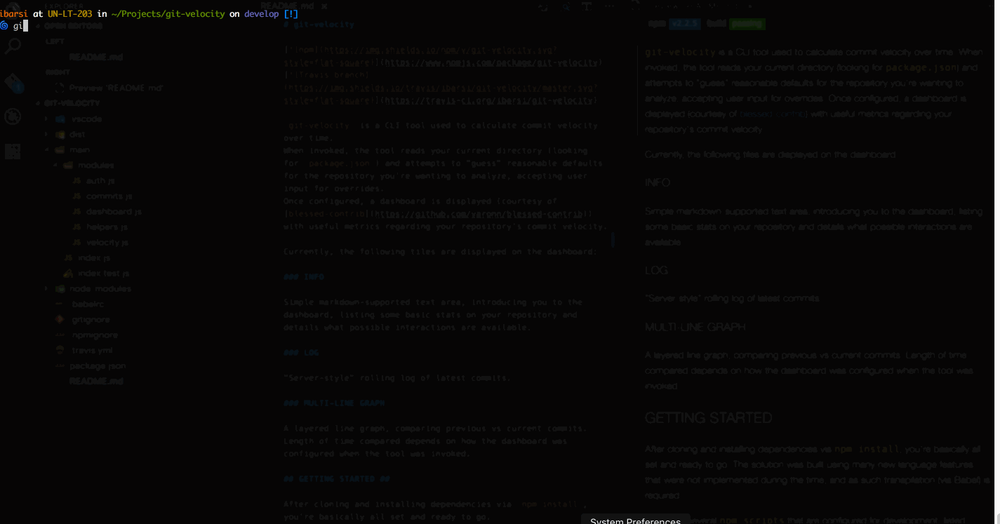

# git-velocity

`git-velocity` is a CLI tool used to calculate commit velocity over time.
When invoked, the tool reads your current directory (looking for `package.json`) and attempts to "guess" reasonable defaults for the repository you're wanting to analyze, accepting user input for overrides.
Once configured, a dashboard is displayed (courtesy of [blessed-contrib](https://github.com/yaronn/blessed-contrib)) with useful metrics regarding your repository's commit velocity.

Currently, the following tiles are displayed on the dashboard:

### INFO

Simple markdown-supported text area, introducing you to the dashboard, listing some basic stats on your repository and details what possible interactions are available.

### LOG

"Server-style" rolling log of latest commits.

### MULTI-LINE GRAPH

A layered line graph, comparing previous vs current commits. Length of time compared depends on how the dashboard was configured when the tool was invoked.

## GETTING STARTED ##

After cloning and installing dependencies via `npm install`, you're basically all set and ready to go.
The solution was built using many new language features that were not implemented during the time, and as such transpilation (via Babel) is required.

There are several `npm scripts` that are configured for development, listed below:

* `build` - Transpiles source files and generates distributables in `/dist`.
* `debug` - Executes `build`, then runs the distributed application files with the internal debugger listening on port 12345.
There is a VS Code `launch.json` file configured for debugging and runs this command internally.
* `start` - Runs the distributed application.
